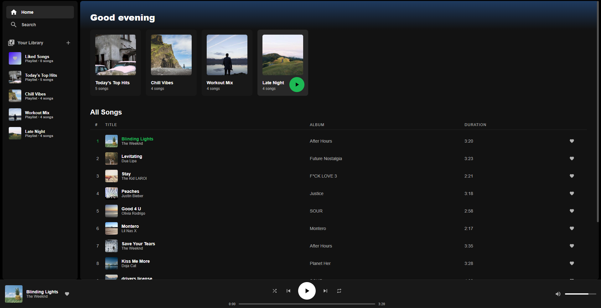
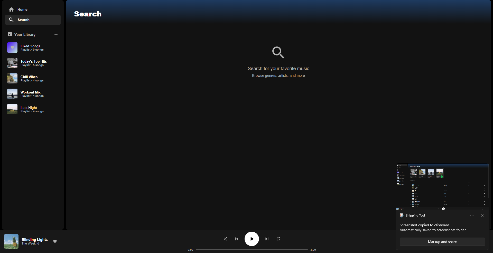
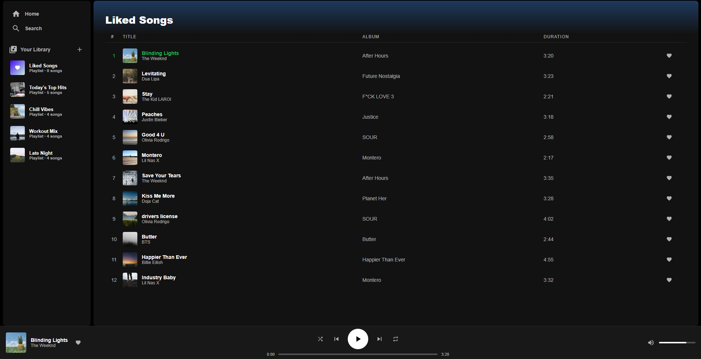

# 🎵 Spotify Clone (React)

A **Spotify-inspired music player UI** built with **React**.
This project replicates the core interface and behavior of Spotify including playlists, track playback simulation, liked songs, and a responsive music player.

It is a **frontend-only application** designed to practice **React state management, UI design, and component logic**.

---

## 🚀 Features

* 🎧 Music player with **Play / Pause / Next / Previous**
* ⏱ **Track progress bar** with seek functionality
* 🔀 **Shuffle and Repeat controls**
* ❤️ **Like / Unlike songs**
* 📚 **Your Library** with playlists
* 🎼 Playlist view with track listing
* 🎨 Spotify-style **UI and layout**
* 🔊 Volume control with mute
* 📀 **Now Playing section**
* 📱 Smooth hover animations and interactions

---

## 🛠 Tech Stack

* **React**
* **JavaScript (ES6+)**
* **React Hooks**

  * `useState`
  * `useEffect`
  * `useRef`
  * `useCallback`
* **CSS (inline + custom styles)**
* **SVG Icons**

---

# 📂 Project Structure

```bash
Spotify-Clone-App
│
├── node_modules/          # Installed project dependencies
│
├── public/
│   └── vite.svg           # Default Vite asset
│
├── screenshots/           # Project screenshots for README preview
│
├── src/
│   ├── assets/            # Static assets (images, icons, etc.)
│   ├── App.css            # Main component styles
│   ├── App.jsx            # Main Spotify clone component
│   ├── index.css          # Global styles
│   └── main.jsx           # React application entry point
│
├── .gitignore             # Files ignored by Git
├── eslint.config.js       # ESLint configuration
├── index.html             # Root HTML template
├── package.json           # Project dependencies & scripts
├── package-lock.json      # Dependency lock file
├── vite.config.js         # Vite build configuration
└── README.md              # Project documentation
```

## ⚙️ Installation

Clone the repository:

```bash
git clone https://github.com/aksmisr/Spotify-Clone-App.git
```

Navigate into the project folder:

```bash
cd Spotify-Clone-App
```

Install dependencies:

```bash
npm install
```

Run the development server:

```bash
npm run dev
```

The app will start at:

```
http://localhost:5173
```

---

## 🎮 How It Works

The application simulates music playback using a **timer-based progress system**.

Key logic:

* `setInterval()` updates song progress
* `useRef` stores interval references
* `useCallback` optimizes track switching
* `useState` manages:

  * current track
  * playing state
  * volume
  * liked songs
  * playlists
  * queue

---

## 📸 Preview

### 🏠 Home Page


### 🔎 Search Page


### ❤️ Liked Songs


---

## ✨ Interface Features

The UI includes the following components:

- Sidebar navigation
- Playlist cards
- Track list with hover play button
- Bottom music player
- Volume slider
- Like button
- Shuffle & repeat controls

## 📌 Future Improvements

Possible enhancements:

* 🎵 Real audio playback using `<audio>`
* 🔍 Search functionality
* 👤 User authentication
* ☁️ Backend with playlists storage
* 📱 Fully responsive mobile design
* 🎧 Queue management
* 🎼 Dynamic music API integration

---

## 🎓 Learning Purpose

This project helps practice:

* React UI architecture
* State management
* Interactive UI design
* Music player logic
* Modern JavaScript patterns

---

## 📄 License

This project is licensed under the **MIT License**.

---

## Author

**Aakash Mishra**


## ⭐ Support

If you like this project, please **star the repository** on GitHub ⭐


